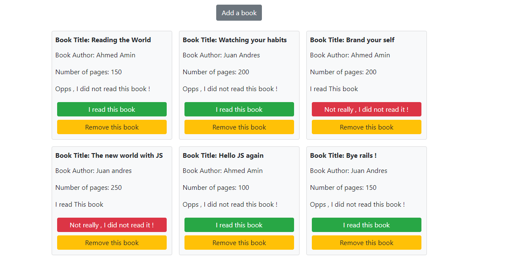
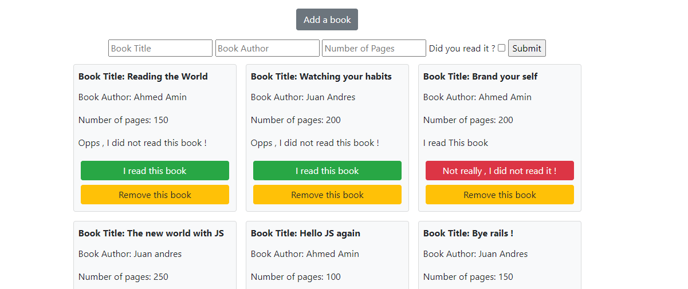

# Javascript Library

>This is a web application created created with simple HTML, CSS and JavaScript code for educational purposes. By clicking the 'Add Book' button, a form will display in which you can add title, author, how many pages has and confirm if it is already read. A list of the books is going to be displayed below with a button to confirmed the book is read and anthor one to remove it from the list in each of them.

## Built With

- Bootstrap
- Javascript

## Live Demo

[Live Demo Link](https://ahmedamin90.github.io/Library/)

## Getting Started

To get a local copy up and running follow these simple example steps.

### Prerequisites

- A browser
- Text Editor

### Setup

**STEP 1**
In the terminal, Run the following commands.

- `git clone git@github.com:AlanSoto31/Library.git`
- `cd Library-JS`

**STEP 2**

- Then open the `index.html` file using a browser.
- Enjoy the simple library.

## Authors

👤 **Ahmed Amin**

- GitHub: [@AhmedAmin90](https://github.com/AhmedAmin90)
- Twitter: [@AhmedAmin12383](https://twitter.com/AhmedAmin12383)
- LinkedIn: [Ahmed Amin](https://www.linkedin.com/in/web-developer/)

👤 **Juan Raudales**

- GitHub: [@Jarfsoft](https://github.com/Jarfsoft)
- Twitter: [@Jarfsoft](https://twitter.com/Jarfsoft)
- LinkedIn: [Juan Raudales](https://www.linkedin.com/in/juan-raudales-flores-7b0a3b113/)

## 🤝 Contributing

Contributions, issues, and feature requests are welcome!

Feel free to check the [issues page]((https://github.com/AlanSoto31/Library/issues)).

## Show your support

Give a ⭐️ if you like this project!
